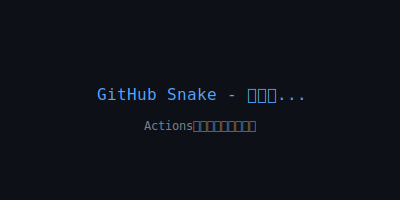

  

# 

---

## 🛠️ 技術スタック

### フロントエンド

  

### バックエンド

  

### データベース

  

### クラウド・DevOps

  

### ツール

  
  

---

## 👀 プロフィール閲覧数

  

---

## 🐍 GitHub Snake

<picture>
  <source media="(prefers-color-scheme: dark)" srcset="github-snake-dark.svg" />
  <source media="(prefers-color-scheme: light)" srcset="github-snake.svg" />
  
</picture>

> **注意**: GitHub Snakeを表示するには、GitHub Actionsを手動実行してください。
> 1. リポジトリの **Actions** タブに移動
> 2. **Generate Snake** ワークフローを選択
> 3. **Run workflow** ボタンをクリック
